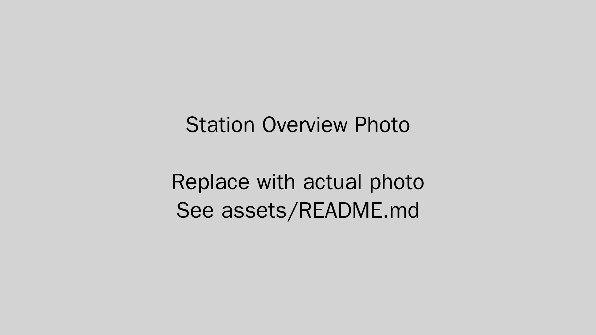

# Digitisation Station Dashboard

> Interactive web application for Georges River Libraries' Digitisation Station at Hurstville Branch



## Overview

The Digitisation Station Dashboard is a patron-facing web application designed to help library users independently digitise their personal media (VHS tapes, audio cassettes, CDs) without requiring staff assistance. The dashboard emphasizes accessibility, plain language, and multilingual support to serve the diverse Georges River community.

### Key Features

- **Equipment Guides**: Step-by-step instructions for VHS and audio digitisation
- **User Workflow Guides**: Goal-oriented guides ("I want to save a VHS tape")
- **AI-Powered Translation**: Real-time translation into 12 community languages
- **Embedded Photos**: Tappable, enlargeable images of the actual station equipment
- **Warning Callouts**: Critical safety and instruction highlights
- **Mobile-Responsive**: Works seamlessly on phones, tablets, and desktop

### Target Audience

First-time users with no technical background, including:
- Seniors digitising family memories
- Multilingual community members
- People with limited computer experience

## Supported Equipment

### Video Digitisation
- **Blackmagic ATEM Mini Pro ISO** - Video switch with USB recording
- **LG DVD/VHS Combo Player (Model 3850R-Z243R)** - Media playback
- **Output**: MP4 files to USB drive

### Audio Digitisation
- **Tascam CD-A580** - Audio recorder/player
- **Output**: MP3 files to USB drive

## Technology Stack

- **React** - UI framework
- **Lucide React** - Icons
- **Tailwind CSS** - Styling
- **Anthropic Claude API** - Translation feature
- **JavaScript/JSX** - Core language

## Project Structure

```
Digitisation-Station/
├── src/
│   └── DigitisationStationDashboard.jsx   # Main React component
├── assets/
│   ├── station-overview.jpg                # Full station photo
│   ├── keypad-closeup.jpg                  # Keypad detail photo
│   └── README.md                           # Asset documentation
├── docs/
│   ├── DEPLOYMENT.md                       # Deployment instructions
│   ├── EQUIPMENT.md                        # Equipment specifications
│   └── VERIFICATION_CHECKLIST.md           # Pre-launch quality check
├── public/
│   └── index.html                          # HTML template
├── package.json                            # Dependencies
├── .gitignore                              # Git ignore rules
└── README.md                               # This file
```

## Installation & Setup

### Prerequisites

- Node.js 16+ and npm
- Anthropic API key (for translation feature)

### Local Development

1. **Clone the repository**
   ```bash
   git clone https://github.com/cwrigh13/Digitisation-Station.git
   cd Digitisation-Station
   ```

2. **Install dependencies**
   ```bash
   npm install
   ```

3. **Add your assets**
   - Place station photos in `assets/` folder:
     - `station-overview.jpg` - Full view of the digitisation station
     - `keypad-closeup.jpg` - Close-up of the Blackmagic ATEM keypad

4. **Start development server**
   ```bash
   npm start
   ```
   
   The dashboard will open at `http://localhost:3000`

### Production Build

```bash
npm run build
```

This creates an optimized production build in the `build/` folder.

## Translation Feature

The dashboard includes AI-powered translation using the Anthropic Claude API. The translation panel appears on every guide and supports 12 languages:

- Chinese (Simplified & Traditional)
- Arabic
- Greek
- Korean
- Vietnamese
- Filipino
- Hindi
- Nepali
- Italian
- Spanish
- Portuguese

### API Configuration

The Anthropic API key is **not required** for basic dashboard functionality—translation requests are authenticated automatically through the Claude API endpoint. For local testing of translations, you may need to configure CORS or use a proxy.

## Deployment

See [DEPLOYMENT.md](docs/DEPLOYMENT.md) for detailed deployment instructions for:
- Static hosting (Netlify, Vercel, GitHub Pages)
- Library web server deployment
- Kiosk/tablet configuration

## Customization

### Adding New Languages

Edit the `languages` array in `DigitisationStationDashboard.jsx`:

```javascript
const languages = [
  { code: 'fr', name: 'French', native: 'Français' },
  // ... add more languages
];
```

### Updating Equipment Guides

1. Edit the `renderContent()` function in the React component
2. Update the corresponding text in `getSectionContent()` for translation support
3. Update equipment photos in the `assets/` folder

### Styling

The dashboard uses Tailwind CSS. Modify the className attributes to customize colors, spacing, and layout.

## Pre-Launch Checklist

Before deploying to production, complete the verification checklist in [docs/VERIFICATION_CHECKLIST.md](docs/VERIFICATION_CHECKLIST.md). This ensures:

- All instructions match the physical equipment
- Photos accurately reflect the current setup
- Translation feature works correctly
- All warnings and callouts are present
- Guides are tested with actual first-time users

## Accessibility

The dashboard is designed with accessibility in mind:

- Plain language instructions
- Large, tappable buttons
- High contrast text
- Mobile-responsive layout
- Right-to-left language support (Arabic)
- Clear warning callouts with icons

## Maintenance

### When Equipment Changes

1. Take new photos of the updated setup
2. Update equipment guides with new button names/locations
3. Re-run the verification checklist
4. Test with a first-time user

### Content Updates

1. Edit the React component
2. Test locally
3. Build for production
4. Deploy updated version
5. Re-verify with the checklist

## Support & Contact

**For library staff:**
- Technical issues: Contact your IT department
- Content questions: Refer to verification checklist
- Equipment questions: See [docs/EQUIPMENT.md](docs/EQUIPMENT.md)

**For patrons:**
- Ask staff at the Hurstville Branch front desk

## Contributing

This project is maintained by Georges River Libraries. For suggestions or improvements, contact the library's IT department or create an issue in this repository.

## License

© Georges River Libraries. Internal library use only.

## Acknowledgments

- Georges River Libraries staff
- Hurstville Branch community members who tested the station
- Anthropic Claude for translation capabilities

---

**Version**: 1.0.0  
**Last Updated**: May 2026  
**Maintained By**: Georges River Libraries
